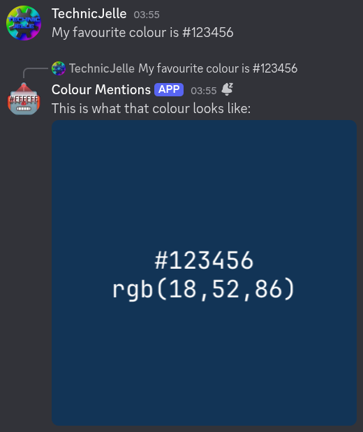
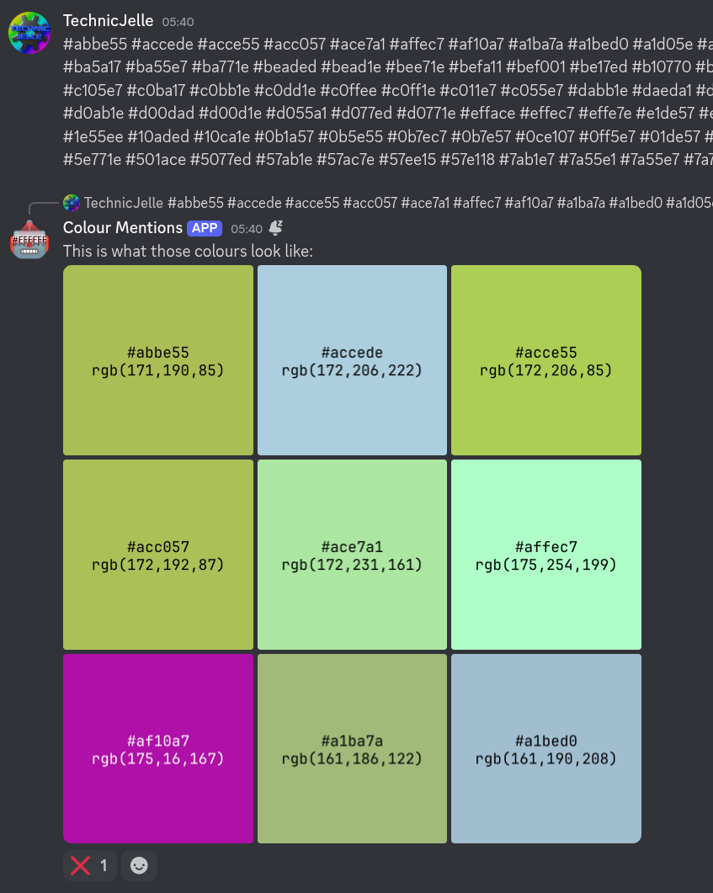

# Discord Colour Mention Bot

A simple Discord bot that replies to messages that contain a colour code with an image in that colour



Each message from the bot will have a ❌ react on it, which you can click to delete it.

Handles up to nine colours per message:


## How to use

1. [Click here to download the Linux executable](../../releases/latest)
2. Create a bot account using [this guide](https://nyxx.l7ssha.xyz/docs/tutorials/creating_a_bot_account)
    - You may use the [icon.png](icon.png) provided in this repo as the picture, if you don't have a custom one
    - The bot requires the **Privileged Gateway Intents** > **Message Content Intent** option to be _enabled_,
      so it can check all the messages if they contain a colour code to display.
3. Start the bot with the following command, replacing the placeholder token with the token you got in step 2:
```bash
DISCORD_TOKEN=abcdefghijklmnopqrstuvwxyz1234567890 ./DiscordColourMentionBot
```

To stop the bot, press `Ctrl`+`C` in the terminal window.

## Credit
The included font JBMono.zip is [JetBrainsMono-Regular](https://www.jetbrains.com/lp/mono/),
used under the [OFL-1.1 licence](https://github.com/JetBrains/JetBrainsMono/blob/master/OFL.txt).
