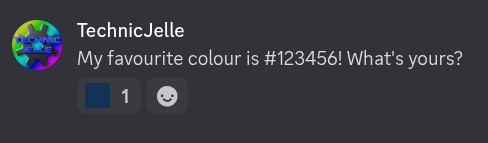
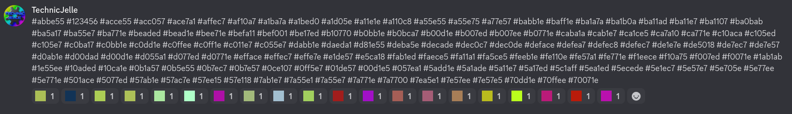
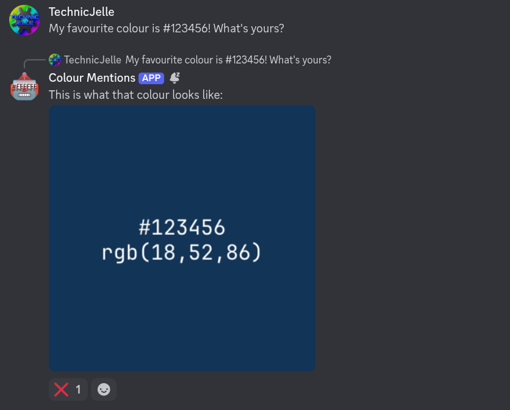
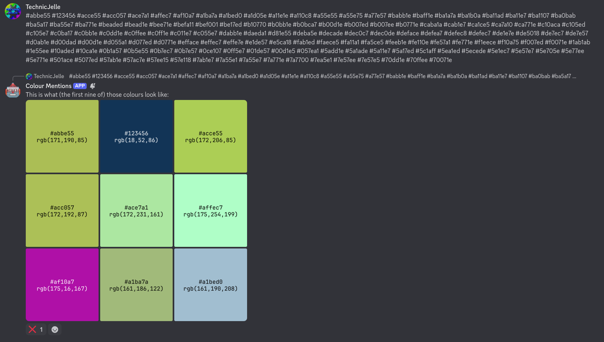
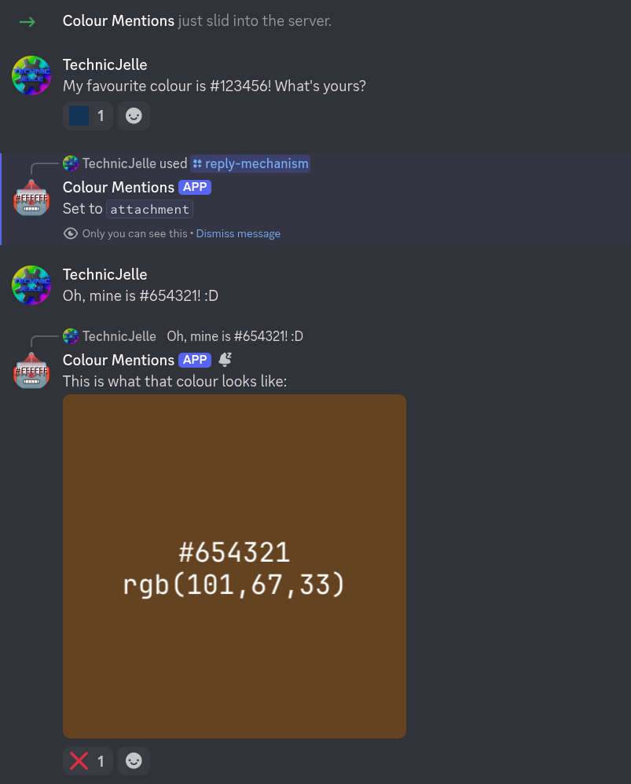

# Discord Colour Mention Bot

A small Discord bot that displays the colour of messages that contain a colour code.

It can display the colour with two different mechanisms:

1. As an emoji reaction to the message:  
     
    - The reaction can be removed (only) by the person who sent the message by clicking the emoji
      (aka also reacting with that colour)
    - Handles up to twenty colours per message:  
      
2. As a message reply with image attachments:  
     
    - Each message from the bot will have a ❌ react on it, which (only) the person
      who sent the message with that colour code can click to delete the reply.
    - Handles up to nine colours per message:
      

Colours with alpha transparency are also supported, in the #RRGGBBAA format!


## How to use

1. [Click here to download the Linux executable](../../releases/latest)
2. Create a Discord bot account using [this guide](https://nyxx.org/tutorials/writing_your_first_bot/)
    - You may use the [icon.png](icon.png) provided in this repo as the picture, if you don't have a custom one
    - The bot requires the **Privileged Gateway Intents** > **Message Content Intent** option to be _enabled_,
      so it can check all the messages if they contain a colour code to display
    - The bot also needs the **Manage Messages** permission, to be able to remove emoji reactions
3. Start the bot with the following command, but replace the placeholder token with the token you got in step 2:
   ```bash
   DISCORD_TOKEN=abcdefghijklmnopqrstuvwxyz1234567890 ./DiscordColourMentionBot
     ```

To stop the bot, press `Ctrl`+`C` in the terminal window.

Server admins can change the server's preferred reply mechanism with the `/reply-mechanism` command:  
  
(Emoji reactions are the default)


## Credit

The included font JBMono.zip is [JetBrainsMono-Regular](https://www.jetbrains.com/lp/mono/),
used under the [OFL-1.1 licence](https://github.com/JetBrains/JetBrainsMono/blob/master/OFL.txt).
